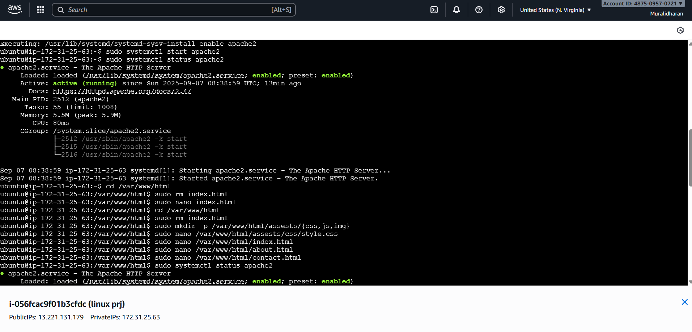
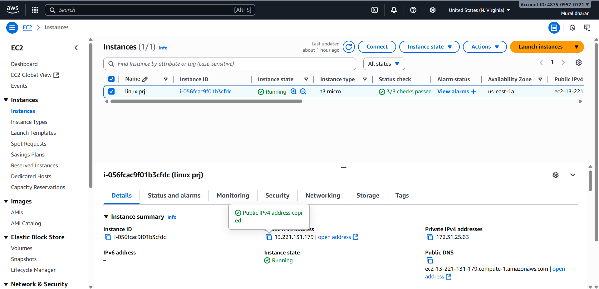

# AWS EC2 Website Hosting

This project demonstrates how to host a static website on an AWS EC2 instance using Apache web server on Linux.

## Services Used
- Amazon EC2
- Apache
- Linux (Ubuntu)
- SSH

## Steps Performed
1. Launched an EC2 instance using Ubuntu AMI
2. Configured security groups to allow HTTP and SSH
3. Installed and configured Apache web server
4. Deployed static website files
5. Verified access via public IP

## Outcome
Successfully hosted a static website accessible through the EC2 public IP.

## Screenshots

### Apache Service Running on EC2

### EC2 Instance Running (AWS Console)

### Website Hosted on EC2

### Website About Page

